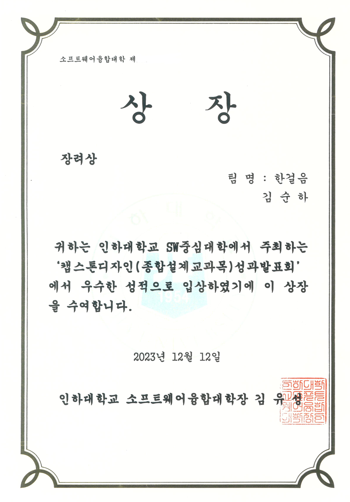

내맘투어 : 취향기반 여행코스 추천 서비스
====
 
### 사용자 맞춤 여행코스를 클릭 몇 번으로 완성하기
원하는 코스, 음식점, 숙소를 간편하게 맞춤으로 추천받자! 사용자 취향기반 여행코스 추천 서비스 내맘투어 
* 구글 맵 API를 통해 사용자가 원하는 지역의 맞춤 여행지를 수집합니다.
* Haversine 공식을 통해 수집된 여행지들간의 최적 경로를 계산합니다.
* 최적 경로를 바탕으로 사용자들에게 지도상에서 Polyline을 통해 경로를 표시합니다.
* 크롤링을 통해 예상 경비를 계산하여 사용자에게 제공합니다.
 

## 인하대학교 캡스톤디자인 설계발표회 장려상

## 시연 영상
[![Video Label]](https://www.youtube.com/watch?v=Xzppjm6Wxkk)

## 팀원 소개
|이름|역할|링크|
|------|---|---|
|김순하| 백엔드, 성과발표회 발표자|[GITHUB](https://github.com/ksh1004)|
|윤보영| 팀장, 프론트엔드|
|윤여선| 크롤링||

## 기술 스택
---
### Frontend

### Backend

## 배포 & 크롤링

## 주요 기능
|지역 선택|
|------|
||
|일정 선택|
||
|선호 여행테마 선택|
||
|선호 음식메뉴 선택|
||
|선호 숙박시설 선택|
||
|여행코스 화면(최초 생성시)|
||
|여행코스 - 예상 경비|
||
|여행코스 - 날짜 변경|
||
|여행코스 - 저장, 마이페이지|
||
|마이페이지 - 코스명 변경|
||
|여행코스 편집 화면|
||
|여행코스 편집 - 새로운 장소 추가|
||
|여행코스 편집 - 저장|
||

## 기획
1. 요구사항 명세서 [링크](https://docs.google.com/document/d/1MH9Xl6nzpJ68t5uQj7w82k6NxB6ku9E2xwzZi40gIcI/edit?usp=sharing)
2. 상세 설계서 [링크](https://docs.google.com/document/d/1B9Esx4NA8pQthEj9O4XoCrj1iYFVH0ckdK4wAzreRmI/edit?usp=sharing)
3. 프로젝트 구조 
